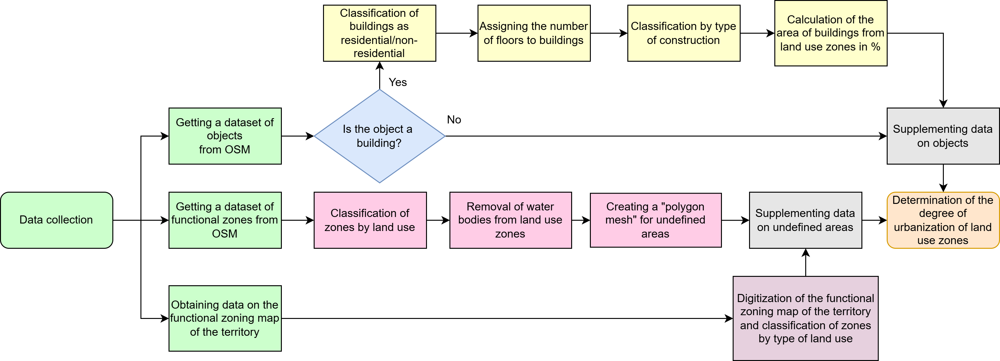

# Comprehensive Territorial Assessment Toolkit

An educational project for analyzing urban environments using OpenStreetMap (OSM) data and spatial analysis techniques.


## Overview
This project demonstrates a methodology for assessing territorial conditions by:
1. Classifying buildings and land use zones
2. Processing geospatial data
3. Creating supplemental grids for undefined areas
4. Evaluating urbanization levels



## Features
- **OSM Data Extraction**: Fetch building/land-use data from OpenStreetMap
- **Building Classification**:
  - Residential vs non-residential categorization
  - Object validation checks
- **Land Use Processing**:
  - Water feature exclusion
  - Functional zoning map digitization
- **Grid Generation**:
  - Polytonal grid creation for undefined territories
- **Urbanization Analysis**:
  - Urban intensity measurement
  - Spatial pattern identification

## Methodology
### 1. Data Collection
- Extract OSM data for target territory
- Classify buildings using tags:
  - `building: residential`
  - `building: commercial`
  - `building: industrial`

### 2. Data Processing
```plaintext
1. Land Use Classification:
   - Filter water bodies (natural=water)
   - Categorize zones using OSM landuse tags

2. Undefined Area Handling:
   - Create polytonal grid overlay
   - Digitize official zoning maps
   - Assign landuse categories to grid cells
```
## Structure
- Examples directory: Jupyter Notebook file with source code with full pipeline
- Data directory: directory with main information sources for calculations

## Installation
git clone https://github.com/Voronapxl/CTAMethod.git \
pip install -r requirements.txt

## Usage
1. Install requirements from requirements.txt
2. Open Jupyter Notebook file in Examples directory
3. Follow the pipeline in Jupyter Notebook file

## Contributors

- Chichkov Egor Andreevich, IDU ITMO [@RaNCer533](https://github.com/RaNCer533) — methodology design, core implementation, initial codebase.
- Vorona Vladimir Andreevich, IDU ITMO [@Voronapxl](https://github.com/Voronapxl) — method enhancements, refactoring.
- Chichkova Natalya Andreevna, IDU ITMO [@nancyan](https://github.com/nancyan) — methodology design, data sourcing, conceptual advisory.


